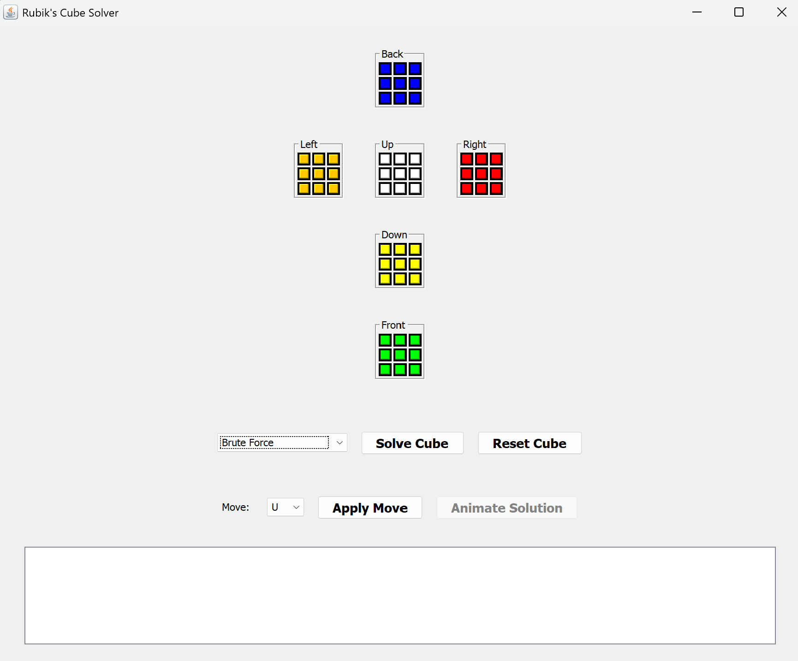
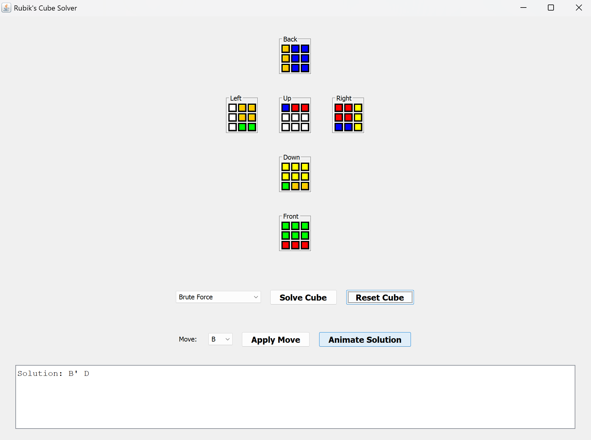

# 🧩 2D Rubik's Cube Solver

## 🎥 Demo Video  
Watch it in action: [https://youtu.be/ydkVJTvn0zc](https://youtu.be/ydkVJTvn0zc)

---

## Description
A Java-based **Rubik’s Cube Solver** with a graphical interface. It supports:

- **Brute Force (IDDFS)** – Uses depth-first search to explore move sequences and solve the cube.
- **Optimal Solver (IDA*)** – Uses a heuristic-based search to find the shortest solution efficiently.

## Installation
1. Ensure **Java** (JDK) is installed.
2. Download or clone the repository.
3. Compile the project:
   ```sh
   javac *.java
   ```
4. Run the program:
   ```sh
   java RubiksCubeGUI
   ```

## Usage
- **Apply Moves**: Select a move from the dropdown and click `Apply Move`.
- **Scramble the Cube**: Apply multiple moves manually.
- **Solve the Cube**: Choose a solving method and click `Solve Cube`.
- **View Solution**: The solution sequence appears in the output area.
- **Animate Solution**: Click `Animate Solution` to watch the solving process step-by-step.
- **Reset Cube**: Click `Reset Cube` to return to a solved state.

## Screenshots
### Solver Interface


### Example Solution


## Author
**Taqi Tazwar**
